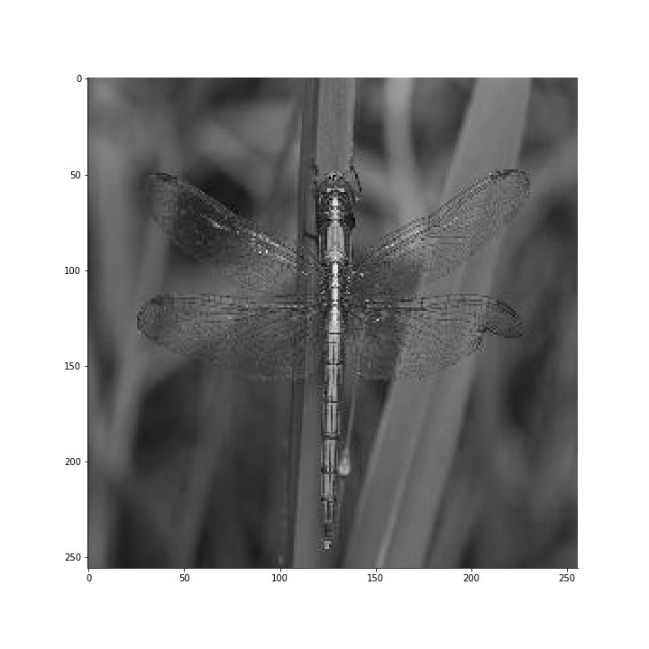
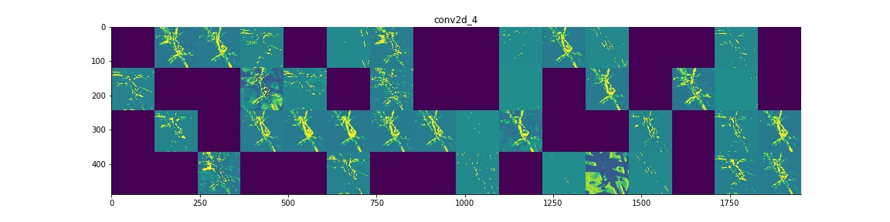

# The_Linnaeus_Bot

## Introduction

This project utilizes deep learning neural networks to classify images of damselflies and dragonflies and to generate images through image de-noising techniques (auto-encoders).

_For those interested in a shorter recap:_ [_Presentation Slides_](https://docs.google.com/presentation/d/1xrlXFUVkA1hmsYD6TaPTXyuSGk6ACH_ZHcb40gw1cX0/edit?usp=sharing "Presentation")

### Table of Contents

   - [Technical Description](#technical-description)
  
   - [Data and EDA](#data-and-eda)
       
   - [Supervised Model](#supervised-model)

   - [Unsupervised Model](#unsupervised-model)

   - [Future Improvements](#future-improvements)

## Technical Description

### Process

For this project, I used part of a google competition dataset; [iNat Challange 2019](https://sites.google.com/view/fgvc6/competitions/inaturalist-2019/ "iNat Challange 2019"). The dataset contained 8462 damselfly images (1.72 GB) and 9197 dragonfly images (1.76 GB). All the images were resized to have a maximum dimension of 800 pixels and saved as JPEG. I then process the images and train a convolutional neural network (CNN) to distinguish between a dragonfly and a damselfly. Additionally, I experimented with image de-noising techniques using CNN's to generate images of dragonflies for classification purposes.

Python libraries

  - [NumPy](https://www.numpy.org/ "Numpy")

  - [Pillow](https://pillow.readthedocs.io/en/stable/ "Pillow")
  - [Keras](https://keras.io/ "Keras")

  - [Scikit-learn](https://scikit-learn.org/stable/ "Sklearn")
  - [Matplotlib](https://matplotlib.org/ "Matplotlib")
  - [Plotly](https://plot.ly/ "Plotly")
  
## Data and EDA

The original dataset contained 82 GB of images for various living organisms. Due to time constraint, I focused on the 8462 damselfly, and 9197 dragonfly images.

As part of the image processing stage, I resize every image to 256 by 256 pixels, grayscale, convert the image to a Numpy array, and normalized the pixel values by dividing every pixel by 255. Additionally, I augmented the data and created the mirror image to doubled the number of available images.

### Creating the Test Set

After preparing the images for analysis I had 16924 (215 MB) damselfly images, and 18394 (237 MB) dragonfly images. The training set comprised of 12694 damselfly and 13797 dragonfly images (26491‬ images; 75% of the data). The test set comprised of  4230 damselfly and 4597 dragonfly images (8827‬ images; 25% of the data). Due to limited computational power, I saved the training and testing sets for damselflies and dragonflies separately in 4 different .npy files.

## Supervised model

#### Model Architecture

To complete the task of training the CNN, batching the data was necessary. Every batch consists of 4000 images, of which 5% reserved for validation purposes.

  * Train on 4000 Images
  * Save Weights
  * Clear Cache
  * Reload Weights
  * Retrain on 4000 New Images
  * Repeat 6 Times (24000 images total)

 

After training the model on 24000 images the model achieves 85%~ accuracy on the testing set (8827‬ images)

Due to the large volumes of data, I was unable to ensure the image quality. Some of the images were blurry, some with dominant background noise, and some contained more than 1 animal.  Thus, making the training and classification harder.

### Classified Correctly

#### Original 

#### What the Model Sees - First CNN Layer

#### What the Model Sees - Second CNN Layer

#### What the Model Sees - Third CNN Layer

#### What the Model Sees - Forth CNN Layer

### Misclassified

#### Original 

#### What the Model Sees - First CNN Layer

#### What the Model Sees - Second CNN Layer

#### What the Model Sees - Third CNN Layer

#### What the Model Sees - Forth CNN Layer

## Unsupervised models

#### Model Architecture

### Convolutional Autoencoder - Noise Reduction Technique

There's still a lot to learn about unsupervised neural networks. In this experiment, I train a convolutional autoencoder on 18394 dragonfly images, of which 2394 images I reserve for validation purposes.
Because of the large volumes of data, training the autoencoder model on a regular local device is a slow process. Thus, it's still a work in process. However,  using said de-noising technique, I manage to generate low quality (after 15 epochs) dragonfly images. Additionally, as part of the experiment, I attempt to classify said generated images.

_Original image_

_Generated image_

I then attempted to classify the 2394 dragonfly images using the pre-trained classification model.
Surprisingly, the model classified correctly only 825 images (34%), less than the random chance for a binary choice (50%).
Upon careful examination, I couldn't find errors such as wrong labeling in the code that could explain the outcome. Further inquiry is required.

## Future Improvements

1. Improve Image Preprocessing
    - Given this my first time working with image data and despite the time constraints I am happy with the classification results. However, I believe additional data preprocessing such as removing background noise and focusing on the insect before image resizing would improve classification results.

2. Improve Unsupervised Model
   - Examining the change in loss throughout the training,it is evident a deeper neural network autoencoder, and additional training would increase the image generator quality. Also, due to the fact, my local machine was unable able to provide adequate resources for training the model, I consider outsourcing the training process to external services such as AWS's SageMaker.